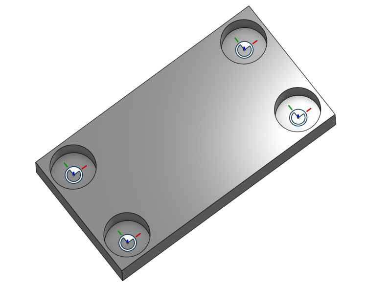
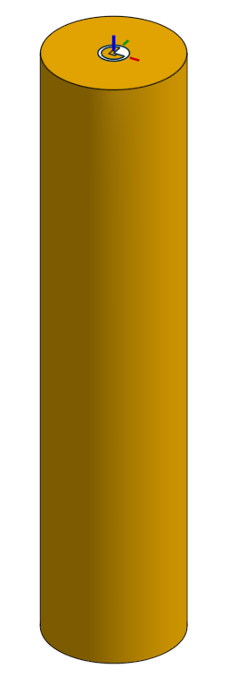

# Onshape to URDF Conversion Guide

This document explains how to convert CAD models from Onshape to URDF for use in simulation environments like PyBullet. It specifically focuses on converting `single components` and creating `dummy` elements to track in PyBullet.

<table>
  <tr>
    <td></td>
    <td></td>
  </tr>
</table>

## Table of Contents

- [My Environment Setup](#my-environment-setup)
- [Setting Up Onshape API Keys](#setting-up-onshape-api-keys)
- [Preparing Your Onshape CAD Model](#preparing-your-onshape-cad-model)
- [Creating Dummy Elements](#creating-dummy-elements)
- [Configuring Conversion Parameters](#configuring-conversion-parameters)
- [Running the Conversion](#running-the-conversion)
- [Loading the Model in PyBullet](#loading-the-model-in-pybullet)
- [Common Issues and Solutions](#common-issues-and-solutions)

## My Environment Setup

- Python 3.9.17
- PyBullet 3.2.6
- onshape-to-robot 0.3.26

## Setting Up Onshape API Keys

1. Log in to the [Onshape Developer Portal](https://dev-portal.onshape.com/)
2. Click on "API Keys" and create a new API key
3. Note down your Access Key and Secret Key

## Preparing Your Onshape CAD Model

When designing your robot model in Onshape, follow these guidelines:

1. **Naming Convention**:
   - Ensure all parts have unique names
   - Use meaningful names without special characters
   - Suggested naming format: `part_name_joint_type` (e.g., `arm_revolute`)

2. **Part Relationships**:
   - Define part relationships using Onshape assembly constraints
   - Supported constraint types: revolute, prismatic, fixed, etc.

3. **Material Properties**:
   - Set material properties (density, color, etc.) for each part
   - Use "Physical Properties" in Onshape to set mass, inertia, etc.

## Creating Dummy Elements

1. Create a part studio to build a small component such as a cube (this will serve as your dummy element)
2. Create an assembly and use a fastened mate to combine your CAD model with the dummy element
3. In the Mate Features panel, rename the mate to follow the naming pattern: `frame_XXX`

## Configuring Conversion Parameters

To export your robot, first create a directory:

```bash
mkdir my-robot
```

Create a `my-robot/config.json` file with the following parameters:

```json
{
    "onshape_api": "https://cad.onshape.com",
    "onshape_access_key": "YOUR_ACCESS_KEY",
    "onshape_secret_key": "YOUR_SECRET_KEY",
    "documentId": "YOUR_DOCUMENT_ID",
    "outputFormat": "urdf",
    "assemblyName": "YOUR_ASSEMBLY_NAME",
    "robotName": "your_robot_name"
}
```

Parameter descriptions:
- `onshape_api`: Onshape API URL, typically `https://cad.onshape.com`
- `onshape_access_key` and `onshape_secret_key`: API keys from the developer portal
- `documentId`: Onshape document ID (obtained from the document URL)
- `outputFormat`: Output format, typically `urdf`
- `assemblyName`: Name of the assembly in Onshape
- `robotName`: Name for the generated robot (used in URDF files)

## Running the Conversion

Execute the following command in the directory containing your `config.json`:

```bash
onshape-to-robot my-robot
```

After conversion, you'll find the generated URDF file and associated resources in the current directory.

## Loading the Model in PyBullet

Use the built-in PyBullet viewer from onshape-to-robot:

```bash
onshape-to-robot-bullet my-robot
```

Observe the information displayed in the terminal. It shows the center position of the component, as well as the positions and rotations of the dummy elements.

```bash
# Example output for the board model
Center of mass:
[0.09052898 0.038593   0.01066   ]

upperleft_frame
- x=0.028440    y=0.057826      z=0.003990
- r=0.000000    p=-0.000002     y=0.094388

lowerleft_frame
- x=0.033152    y=0.008049      z=0.003990
- r=0.000000    p=-0.000002     y=0.094388

upperright_frame
- x=0.147906    y=0.069136      z=0.003990
- r=0.000000    p=-0.000002     y=0.094388

lowerright_frame
- x=0.152618    y=0.019359      z=0.003990
- r=0.000000    p=-0.000002     y=0.094388
```

## Common Issues and Solutions

### Duplicate Link Names

Error message:
```
Warning: Link name is not unique, link names in the same model have to be unique
```

Solution:
- Ensure all parts in Onshape have unique names

---

For more information, visit the [Onshape to Robot Documentation](https://onshape-to-robot.readthedocs.io/en/latest/).
